# Solution Station SPA — Ecosystem Architecture

> **Constitution version**: v2.2.3
> **AWS Account**: `717279716506` · **Region**: `us-east-1`
> **Last updated**: 2026-04-27

Este documento es la **fuente única de verdad** para la arquitectura del ecosistema Solution Station SPA. Todo repositorio del ecosistema debe referenciar este documento en su `CLAUDE.md` (sección 9) para declarar su posición.

---

## Visión general del sistema

Solution Station SPA es una plataforma de cambio de divisas y activos digitales (CLP, USD, COP, VES) orientada al mercado hispanohablante. Las operaciones se realizan íntegramente por **WhatsApp Business**, con un sitio web comercial como vitrina de servicios.

El sistema tiene dos superficies de usuario:

- **Web** (`ssspa-app`): sitio estático de presentación comercial con sección de pagos de Transbank.
- **WhatsApp**: canal de operaciones completo, gestionado por un pipeline de Lambdas con DocumentDB como almacén central.

---

## Diagrama de arquitectura completa

```mermaid
flowchart TB
    classDef actor fill:#f5f5f5,stroke:#777,color:#000
    classDef lambda fill:#FF9900,stroke:#E07800,color:#000
    classDef orch fill:#CC5200,stroke:#993D00,color:#fff
    classDef sqs fill:#CC3870,stroke:#991E4F,color:#fff
    classDef storage fill:#3F8624,stroke:#2D5E1A,color:#fff
    classDef ext fill:#232F3E,stroke:#101820,color:#fff
    classDef apigw fill:#8C4FFF,stroke:#6030CC,color:#fff
    classDef front fill:#1A73E8,stroke:#1257B0,color:#fff

    %% ── ACTORES ──
    UWA(["👤 Usuario\nWhatsApp"]):::actor
    UBROW(["👤 Usuario\nWeb"]):::actor
    UADMIN(["🔑 Operador\nAdmin"]):::actor

    %% ── FRONTEND ──
    subgraph SSSPA["ssspa-app · AWS Amplify + CloudFront"]
        CF["CloudFront CDN"]:::front
        S3H["S3: ssspa-app\nhostingbucket-dev"]:::storage
    end

    %% ── API GATEWAY ──
    subgraph APIGW["API Gateway · pyfcs0fzs4 · us-east-1"]
        GW1["/webhook\nGET · POST"]:::apigw
        GW2["/flows\nGET · POST"]:::apigw
        GW3["/messages · /admin · /users\nGET · POST · DELETE"]:::apigw
        GW4["/payments/response\nPOST"]:::apigw
    end

    %% ── LAMBDAS TIER 1 (entrada) ──
    subgraph LT1["Lambdas — Entry Tier"]
        LWH["lambda-webhook\nHMAC validation\nmessage routing"]:::lambda
        LFL["lambda-flows\nWhatsApp Flows\nremesas interactivas"]:::lambda
        LMSG["⭐ lambda-messages\nOrchestrator\ntransaction lifecycle\nadmin REST API"]:::orch
        LPAY["lambda-payments\nTransbank WebpayPlus\n[en desarrollo]"]:::lambda
    end

    %% ── SQS ──
    subgraph QUEUES["SQS Queues · us-east-1"]
        Q1["webhook-to-messages-queue.fifo"]:::sqs
        Q2["notifications-queue"]:::sqs
        Q3A["transfer-queue\n(standard · entrada)"]:::sqs
        Q3B["transfer-queue.fifo\n(FIFO · reintentos)"]:::sqs
        Q4["payments-queue\n(standard)"]:::sqs
        Q5["odoo-queue.fifo"]:::sqs
        Q6A["odoo-purchse-queue.fifo"]:::sqs
        Q6B["odoo-purchse-queue-sv.fifo"]:::sqs
        Q7["odoo-products-queue.fifo"]:::sqs
        Q8["sii-queue.fifo"]:::sqs
    end

    %% ── LAMBDAS TIER 2 (procesamiento) ──
    subgraph LT2["Lambdas — Processing Tier"]
        LNOT["lambda-notifications\nWhatsApp dispatcher"]:::lambda
        LTR["lambda-transfer\nBinance USDT + P2P\nwithdrawals · balances"]:::lambda
        LOD["lambda-odoo\nboletas electrónicas\n(cod SII 41)"]:::lambda
        LODP["lambda-odoo-purchase\nfacturas de compra"]:::lambda
        LODPR["lambda-odoo-products\nproductos + precios"]:::lambda
        LSII["lambda-sii\nDTE → SII\nvía Odoo"]:::lambda
    end

    %% ── STORAGE ──
    subgraph STORE["Storage · AWS"]
        DB[("DocumentDB\ndocdb-transactions")]:::storage
        S3A["S3: assets.solutionstationspa.com\nassets estáticos: videos, QR"]:::storage
        S3I["S3: solutionstation-images\nimagenes de productos"]:::storage
        SM["AWS Secrets Manager"]:::storage
    end

    %% ── SERVICIOS EXTERNOS ──
    subgraph EXTSVC["External Services"]
        WAAPI["WhatsApp Business API\nMeta Graph v21.0"]:::ext
        ODOOERP["Odoo ERP\nJSON-RPC"]:::ext
        SIIGOV["SII Chile\nDTE Electrónico"]:::ext
        TRANSB["Transbank\nWebpayPlus SDK v5"]:::ext
        BINANCE["Binance\nSpot API + P2P API"]:::ext
        MONGOATLAS["MongoDB Atlas\ntasas de cambio · usuarios"]:::ext
    end

    %% ── CONEXIONES: Frontend ──
    UBROW -->|browse| CF
    CF --> S3H

    %% ── CONEXIONES: WhatsApp ──
    UWA <-->|mensajes| WAAPI
    WAAPI -->|webhook POST| GW1
    WAAPI <-->|Flows cifrados| GW2

    %% ── CONEXIONES: Admin / Pagos ──
    UADMIN -->|API calls| GW3
    UBROW -->|redirect post-pago| GW4

    %% ── CONEXIONES: API Gateway → Lambda Tier 1 ──
    GW1 --> LWH
    GW2 --> LFL
    GW3 --> LMSG
    GW4 --> LPAY

    %% ── CONEXIONES: Lambda Tier 1 → SQS ──
    LWH -->|enqueue| Q1
    Q1 -->|trigger| LMSG

    LMSG -->|send notification| Q2
    LMSG -->|USDT / precios| Q3A
    LMSG -->|iniciar pago| Q4
    LMSG -->|boleta electrónica| Q5
    LMSG -->|factura compra| Q6A
    LMSG -->|"factura compra (sv)"| Q6B
    LMSG -->|DTE emission| Q8
    LMSG -->|product sync| Q7
    LPAY -->|resultado pago| Q4

    %% ── CONEXIONES: SQS → Lambda Tier 2 ──
    Q2 -->|trigger| LNOT
    Q3A -->|trigger| LTR
    Q3B -->|retry trigger| LTR
    Q4 -->|trigger| LPAY
    Q5 -->|trigger| LOD
    Q6A -->|trigger| LODP
    Q6B -->|trigger| LODP
    Q7 -->|trigger| LODPR
    Q8 -->|trigger| LSII

    %% ── CONEXIONES: Lambda Tier 2 → Externos ──
    LNOT -->|enviar mensaje| WAAPI
    LFL <-->|tasas de cambio| MONGOATLAS
    LFL <-->|imágenes productos| S3I
    LTR <-->|withdrawals · balances · P2P| BINANCE
    LTR -->|retry on fail| Q3B
    LTR -->|notificar admin| Q2
    LPAY <-->|crear / confirmar tx| TRANSB
    LOD -->|crear boleta| ODOOERP
    LODP -->|crear factura| ODOOERP
    LODPR <-->|sync productos| ODOOERP
    LSII -->|emitir DTE| ODOOERP
    ODOOERP -->|DTE firmado| SIIGOV
    ODOOERP -->|payment webhook| GW3

    %% ── CONEXIONES: Storage ──
    LMSG <-->|CRUD transacciones| DB
    LWH -->|videos · QR| S3A
    LTR -.->|credenciales Binance| SM
    LFL -.->|private key RSA| SM
```

---

## Registro de repositorios

| Repositorio | Tier | Descripción | Trigger principal |
|---|---|---|---|
| `ssspa-app` | Frontend | Vitrina web + sección de pagos Transbank | Push a `main` (Amplify CI/CD) |
| `lambda-webhook` | Entry | Receptor de webhooks de WhatsApp. Valida firma HMAC-SHA256 y enruta a SQS. | API Gateway `POST /webhook` |
| `lambda-flows` | Entry | Endpoint de WhatsApp Flows. Cifrado RSA-OAEP+AES-128-GCM. Cálculo de remesas. | API Gateway `POST /flows` |
| `lambda-messages` | Orchestrator ⭐ | Núcleo del sistema. Procesa mensajes, gestiona ciclo de vida de transacciones, expone API admin. | SQS `webhook-to-messages-queue.fifo` + API Gateway `/messages /admin /users` |
| `lambda-notifications` | Processing | Despacha mensajes WhatsApp vía Meta Graph API v21.0. | SQS `notifications-queue` |
| `lambda-transfer` | Processing | Operaciones en Binance: retiros USDT por BSC, precios P2P, balances. | SQS `transfer-queue` (standard) |
| `lambda-payments` | Processing | Integración Transbank WebpayPlus: crea y confirma transacciones. **En desarrollo.** | SQS `payments-queue` + API Gateway `POST /payments/response` |
| `lambda-odoo` | Processing | Crea boletas electrónicas en Odoo (código SII 41). | SQS `odoo-queue.fifo` |
| `lambda-odoo-purchase` | Processing | Crea facturas de compra en Odoo. | SQS `odoo-purchse-queue.fifo` + `odoo-purchse-queue-sv.fifo` |
| `lambda-odoo-products` | Processing | Sincroniza productos y precios en Odoo. **No relacionado con pagos.** | SQS `odoo-products-queue.fifo` |
| `lambda-sii` | Processing | Emite DTEs al SII Chile vía Odoo. Maneja idempotencia y DLQ. | SQS `sii-queue.fifo` |

---

## Registro de colas SQS

| Cola | Tipo | Productor principal | Consumidor |
|---|---|---|---|
| `webhook-to-messages-queue.fifo` | FIFO | `lambda-webhook` | `lambda-messages` |
| `notifications-queue` | Standard | `lambda-messages`, `lambda-transfer` | `lambda-notifications` |
| `transfer-queue` | Standard | `lambda-messages` | `lambda-transfer` |
| `transfer-queue.fifo` | FIFO | `lambda-transfer` (reintentos) | `lambda-transfer` |
| `payments-queue` | Standard | `lambda-messages`, `lambda-payments` (resultado) | `lambda-payments` |
| `odoo-queue.fifo` | FIFO | `lambda-messages` | `lambda-odoo` |
| `odoo-purchse-queue.fifo` | FIFO | `lambda-messages` | `lambda-odoo-purchase` |
| `odoo-purchse-queue-sv.fifo` | FIFO | `lambda-messages` | `lambda-odoo-purchase` |
| `odoo-products-queue.fifo` | FIFO | `lambda-messages` | `lambda-odoo-products` |
| `sii-queue.fifo` | FIFO | `lambda-messages` | `lambda-sii` |

> **Nota de nombre**: `odoo-purchse-queue` contiene un typo histórico (falta la `a` de "purchase"). El nombre es el recurso real desplegado en AWS y **no debe corregirse** sin migración coordinada de todos los productores y consumidores.

---

## Registro de rutas API Gateway

**API Gateway ID**: `pyfcs0fzs4` · **Tipo**: REST API · **Región**: `us-east-1`

| Recurso | Método | Lambda | Descripción |
|---|---|---|---|
| `/webhook` | GET | `lambda-webhook` | Verificación de webhook WhatsApp (challenge) |
| `/webhook` | POST | `lambda-webhook` | Recepción de mensajes entrantes de WhatsApp |
| `/flows` | GET | `lambda-flows` | Health check / challenge de WhatsApp Flows |
| `/flows` | POST | `lambda-flows` | Ejecución de pantallas de WhatsApp Flows |
| `/messages` | GET | `lambda-messages` | Consultas de estado (uso interno / admin) |
| `/messages` | POST | `lambda-messages` | Webhook de Odoo (notificación de pagos verificados) |
| `/admin` | GET | `lambda-messages` | Consultas administrativas |
| `/admin` | DELETE | `lambda-messages` | Operaciones de borrado administrativo |
| `/users` | GET | `lambda-messages` | Consulta de usuarios / transacciones |
| `/users` | DELETE | `lambda-messages` | Eliminación de usuarios |
| `/payments/response` | POST | `lambda-payments` | Confirmación de pago Transbank (redirect post-pago) |

---

## Registro de buckets S3

| Bucket | Uso | Accedido por |
|---|---|---|
| `ssspa-app` | Artefactos de la app frontend | Amplify CI/CD |
| `ssspa-20241207000203-hostingbucket-dev` | Hosting del sitio web (CloudFront origin) | CloudFront → usuarios web |
| `amplify-ssspa-dev-0afb4-deployment` | Artefactos de despliegue de Amplify | Amplify internamente |
| `assets.solutionstationspa.com` | Assets estáticos: videos de bienvenida, imágenes QR | `lambda-webhook` |
| `solutionstation-images` | Imágenes de productos para WhatsApp Flows | `lambda-flows` |
| `secrets.solutionstationspa` | Secretos / certificados sensibles (backup S3) | Deploy jobs en CI/CD |

---

## Base de datos

| Recurso | ARN | Tipo | Uso |
|---|---|---|---|
| `docdb-transactions` | `arn:aws:rds:us-east-1:717279716506:db:docdb-transactions` | DocumentDB (MongoDB-compatible) | Almacén central de transacciones, estado del bot, historial de operaciones. Accedido exclusivamente por `lambda-messages`. |
| MongoDB Atlas | Conexión string externa | MongoDB | Tasas de cambio en tiempo real y datos de usuarios para `lambda-flows`. |

---

## Servicios externos

| Servicio | Uso | Lambdas que lo consumen |
|---|---|---|
| WhatsApp Business API (Meta Graph v21.0) | Recepción y envío de mensajes + WhatsApp Flows | `lambda-webhook` (entrada), `lambda-flows` (Flows), `lambda-notifications` (salida) |
| Odoo ERP (JSON-RPC) | Creación de documentos fiscales, gestión de productos | `lambda-odoo`, `lambda-odoo-purchase`, `lambda-odoo-products`, `lambda-sii` |
| SII Chile (DTE Electrónico) | Envío de documentos tributarios electrónicos | Vía Odoo → `lambda-sii` |
| Transbank WebpayPlus SDK v5 | Pasarela de pagos chilena | `lambda-payments` |
| Binance (Spot API + P2P API) | Retiros USDT, precios P2P, balances de cuenta | `lambda-transfer` |
| AWS Secrets Manager | Credenciales Binance, claves RSA privadas | `lambda-transfer`, `lambda-flows` |

---

## Cómo usar este documento en tu repo

Cada repositorio del ecosistema debe incluir en su `CLAUDE.md` (sección 9) un mini-diagrama Mermaid que muestre su posición específica en esta arquitectura. El diagrama debe declarar:

1. **Upstream**: qué lo dispara (SQS queue, API Gateway route, otro Lambda)
2. **Downstream**: a qué escribe o llama (SQS queue, DB, API externa)
3. **Nodo destacado**: el propio repo marcado con `★ THIS REPO`

Ver `templates/CLAUDE.md` sección 9 para la plantilla de mini-diagrama.

Para migrar un repo existente a v2.2.0, usar el change OpenSpec: `upgrade-constitution-v2.1-to-v2.2`.
