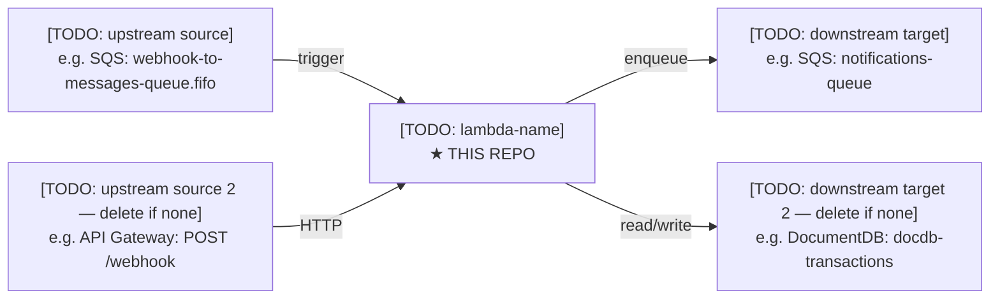

# CLAUDE.md
<!-- openspec-constitution v2.2.3 — template CLAUDE.md -->
<!-- Copy to repo root. Replace all [TODO: ...] placeholders before closing Phase 8. -->
<!-- This file is for AI agents. Keep it in English. For human onboarding, see README.md. -->

## Project overview

[TODO: one paragraph — what this repo does, why it exists, who uses it]

- **Runtime**: Node.js 22, ES modules (`"type": "module"`)
- **Execution environment**: [TODO: AWS Lambda / container / CLI / other]
- **Main entry point**: [TODO: e.g. `src/index.js` exports `handler`]
- **Adheres to**: openspec-constitution v2.2.3

## Development commands

```bash
npm test              # run tests once (no coverage)
npm run test:coverage # run tests with coverage report
npm run test:watch    # watch mode for local development
npm run lint          # ESLint check
npm run lint:fix      # ESLint auto-fix
npm run format        # Prettier write
npm run format:check  # Prettier check (used in CI)
```

[TODO: add any repo-specific commands, e.g. deploy scripts, local invocation]

## Architecture

[TODO: describe the data flow from entry point to external services]

```
[TODO: ASCII or text diagram, e.g.]
handler (src/index.js)
  └── validates env vars + request
  └── HandlerName (src/handlers/HandlerName.js)
        └── ServiceA (src/services/ServiceA.js) → external API
        └── ServiceB (src/services/ServiceB.js) → AWS S3
```

**Module responsibilities:**

| Module | Responsibility |
|---|---|
| `src/index.js` | Entry point, env validation, routing |
| `src/handlers/` | Business logic orchestration |
| `src/services/` | External clients (DB, S3, HTTP) — mocked in tests |
| `src/config/logger.js` | pino logger singleton — imported by all modules that log |
| `src/config/` | Static config, maps, constants |
| `src/utils/` | Pure reusable functions |

[TODO: adjust table to match actual structure]

## Code conventions

Follows openspec-constitution v2.2.3. Repo-specific deviations:

- [TODO: list any local deviations documented in openspec/project.md, or write "None."]

Key patterns in this repo:

- Logger: import `logger` from `src/config/logger.js`. Use `logger.child({ requestId })` in Lambda handlers. Never use `console.log` in production code.
- [TODO: e.g. "All DB operations go through `src/services/DatabaseService.js` singleton"]
- [TODO: e.g. "Errors thrown as `new AppException(statusCode, message)` from `src/utils/errors.js`"]

## Testing

- **Framework**: Vitest 4+, coverage via v8
- **Coverage thresholds**: lines ≥ 80%, functions ≥ 80%, statements ≥ 80%, branches ≥ 70%
- **Excluded from coverage**: `src/services/**` (fully mocked)

**Mock strategy:**

- External clients (`services/`) are mocked with `vi.mock()` in each test file
- [TODO: note any `vi.hoisted()` usage for AWS SDK or similar]
- Env vars are set in `tests/setup.js` (loaded via `setupFiles` before module evaluation)

**Running a single test:**

```bash
npx vitest run tests/FileName.test.js
```

[TODO: add any other testing notes — e.g. which tests require real credentials, integration test setup]

## Secrets and environment

Required env vars (validated at cold start in `src/index.js`):

| Variable | Description | How to obtain |
|---|---|---|
| [TODO: VAR_NAME] | [TODO: what it is] | [TODO: where to get it] |

For local development, copy `.env.example` to `.env` and fill in values. Never commit `.env`.

## CI/CD

- **Platform**: GitHub Actions (`.github/workflows/[TODO: filename].yml`)
- **Jobs**: `test` → `deploy` (deploy has `needs: test`)
- **Trigger**: [TODO: e.g. push to `main`, manual `workflow_dispatch`]
- **Deploy target**: [TODO: e.g. AWS Lambda `function-name` in `us-east-1`]
- **Secrets required in GitHub**: [TODO: list secrets, e.g. `AWS_ACCESS_KEY_ID`, `AWS_SECRET_ACCESS_KEY`]

The `test` job uploads a coverage artifact (7-day retention). Deploy only runs if all tests pass.

## Non-obvious details

- [TODO: document gotchas, counterintuitive decisions, known workarounds]
- [TODO: e.g. "The Lambda timeout is set to 29s — 1s less than API Gateway's 30s limit to ensure a clean error response"]
- [TODO: e.g. "Package X is pinned to v2.3.1 because v2.4.0 broke ESM imports — see issue #42"]

## Position in ecosystem

Reference: [Solution Station SPA — Ecosystem Architecture](https://github.com/juandpm/openspec-constitution/blob/main/docs/ecosystem.md)



**Upstream** (what triggers or calls this service):
- `[TODO: e.g. SQS: webhook-to-messages-queue.fifo]`
- `[TODO: e.g. API Gateway: POST /webhook (pyfcs0fzs4)]`

**Downstream** (what this service writes to or calls):
- `[TODO: e.g. SQS: notifications-queue]`
- `[TODO: e.g. DocumentDB: docdb-transactions]`

**AWS Lambda function name**: `[TODO: exact function name as deployed in AWS]`
